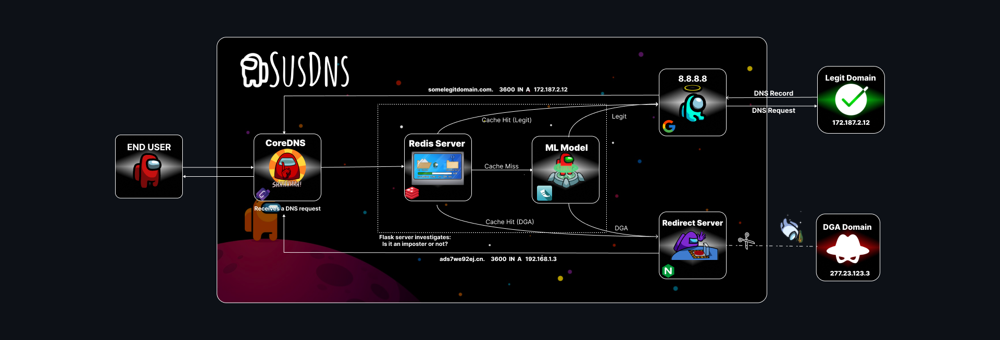
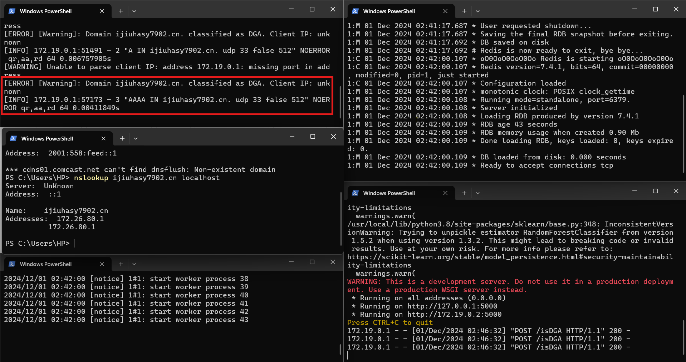
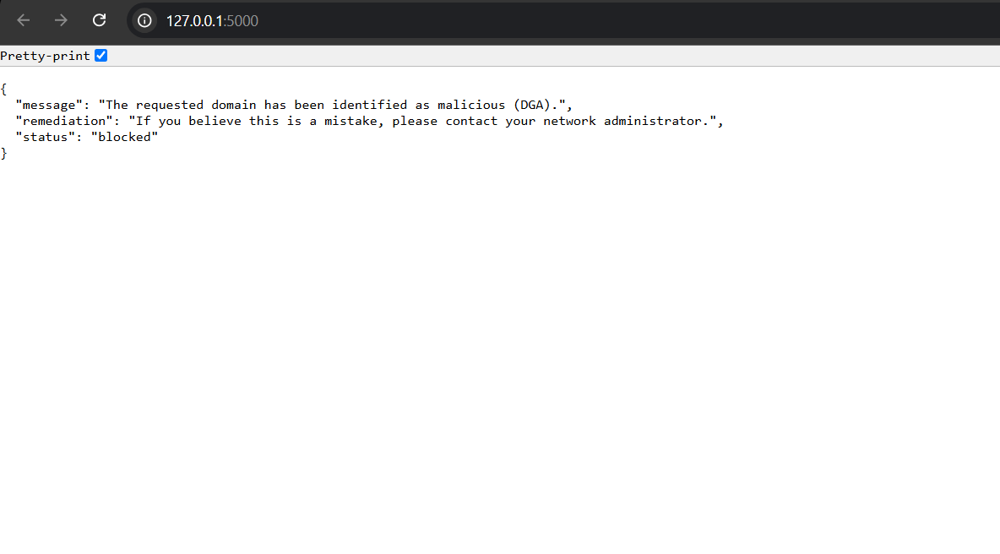
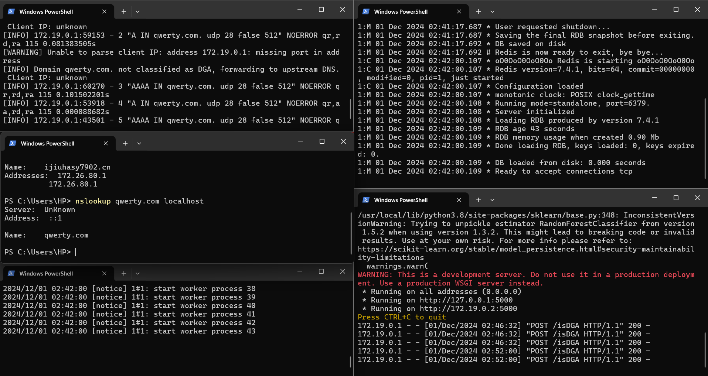
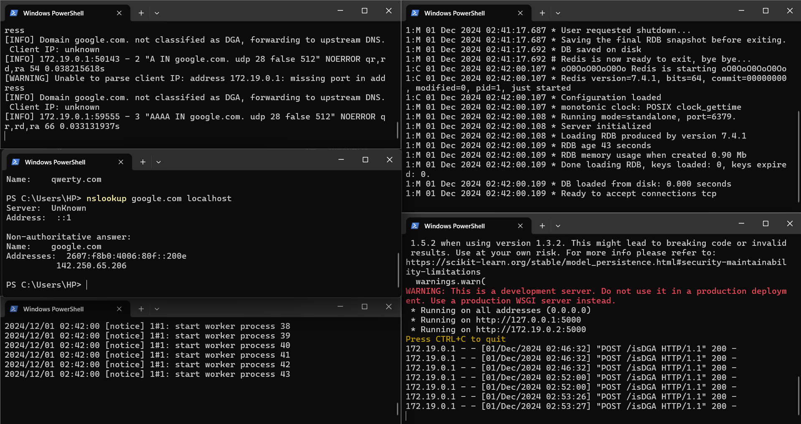

# 

SuSDNS is a DNS-based proof-of-concept application designed to detect and block malicious domains (e.g., DGA domains). It leverages a machine learning model hosted on a Flask server to classify domains in real-time and responds accordingly by either blocking or forwarding the DNS request.

---
## Made With 🛠️

<p align="center">
   &nbsp;&nbsp;&nbsp;
   &nbsp;&nbsp;&nbsp;
  
</p>
<p align="center">
  <strong>Docker</strong> &nbsp; <strong>CoreDNS</strong> &nbsp; <strong>Redis</strong>
</p>

<p align="center">
   &nbsp;&nbsp;&nbsp;
  
</p>
<p align="center">
  <strong>Flask</strong> &nbsp; <strong>NGINX</strong>
</p>


---
## Table of Contents

- [Overview](#overview)
- [Architecture Diagram](#architecture-diagram)
- [Features](#features)
- [Setup](#setup)
- [Usage](#usage)
- [Contributing](#contributing)
- [License](#license)

---

## Overview

SuSDNS identifies potentially harmful domain names using random forest algorithm and prevents their resolution. Malicious requests are redirected to a warning page, while legitimate requests are forwarded to the upstream DNS server.

---

## Architecture Diagram

  
_Description_: The diagram illustrates the flow of DNS queries from clients to the SuSDNS CoreDNS plugin and the Flask ML server for classification.

---

## Features

- **Real-Time Domain Detection**: Classifies domains as "legitimate" or "malicious (DGA)."
- **Domain Blocking**: Prevents access to malicious domains.
- **Custom Redirection**: Redirects users to a warning page for blocked domains.
- **Caching**: Speeds up subsequent classification using Redis.
- **Dockerized Deployment**: Easy setup and scaling with Docker.

---

## Setup

### Prerequisites

- Docker and Docker Compose installed
- CoreDNS installed
- Flask and Python dependencies
- Redis database

## Demonstration

### DNS Query Example:
1. A user queries a domain (e.g., `example.com`).
2. The request is intercepted by the TooRedDNS plugin.
3. The domain is classified using the Flask ML server.
   - **Legitimate**: The query is resolved normally.
   - **Malicious**: The user is redirected to a warning page.

### Warning Page:
If a domain is classified as malicious, the user sees a JSON response like this:

```json
{
  "status": "blocked",
  "message": "The requested domain is classified as potentially harmful and has been blocked."
}
```
---

## Screenshots

### 1. Real-Time DNS Detection


### 2. Malicious Domain Warning Page


### 3. Querying Normal NxDomain 


### 4. Querying Normal Domain 



## License

This project is licensed under the [Proprietry License](LICENSE). Unauthorized use, duplication, or distribution is prohibited. For inquiries about usage rights, please contact:

Rushikesh Muley  
Email: rushikeshmuley@outlook.com  .
